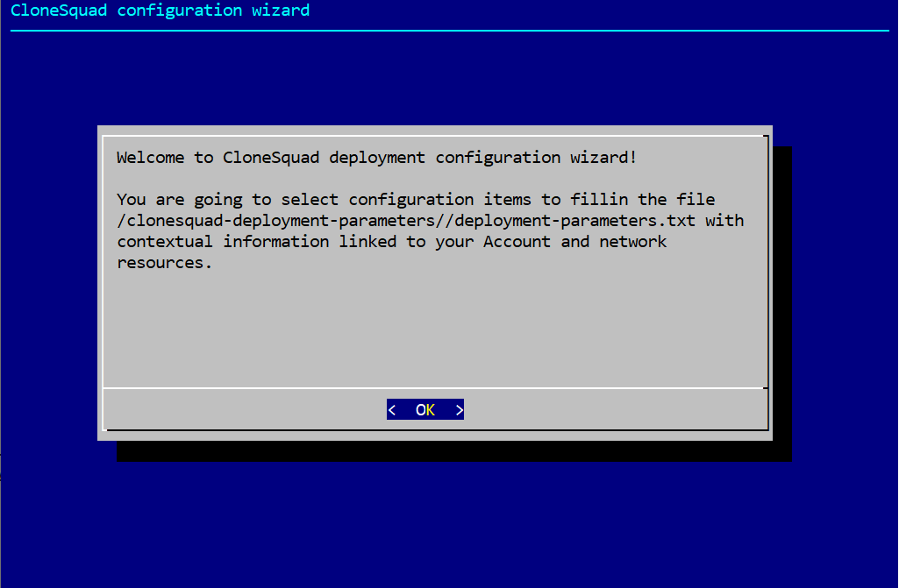

## Configuring the DevKit to launch demonstrations

To increase portability of execution environment needed by CloneSquad activities (dev/run/build/test...), a DevKit is provided as
a Docker container.

It is the vehicule for publishing the CloneSquad releases but also the environment where to launch the various demonstrations.

The DevKit must be configured with essential contextual informations contained in 2 files:
* /clonesquad-deployment-parameters/deployment-parameters.txt
* /clonesquad-deployment-parameters/samconfig.toml

You need to create at least the file `deployment-parameters.txt` in a local directory.

The DevKit is started using the following command line (The parameter files will be located in the current directory):
```shell
docker run -it -v ${PWD}:/clonesquad-deployment-parameters clonesquad/devkit
```

### deployment-parameters.txt

Minimal essential keys to define:

	GroupName=test (or other group you are using)
	InteractLambdaArn=<ARN_for_Interact_lambda_function>
	InstanceAMI=<Amazon_Linux_2_instance_ami_for_demo>
	KeyName=<keyname_for_demo_ec2_instances>
	IAMRole=<name_of_role_for_demo_ec2_instances>
	VPC=<demo-vpc-id>
	Subnet0=<demo-subnet-id0>
	Subnet1=<demo-subnet-id1>
	Subnet2=<demo-subnet-id2>
	SubnetIds=<demo-subnet-id0,demo-subnet-id1,demo-subnet-id2>

**WARNING: It is an error prone process to fill in this file! Please use the wizard to help in this process!**

At launch, if the DevKit can't find the parameter files, it will automatically start the wizard that will help you select the
appropriate configuration items.

> For proper function, the DevKit needs to run on an EC2 instance with an attached role allowing r/w accesses to cloudformation:*, ec2:*, rds:* and iam:* (the wizard only requires read accesses to cloudformation, ec2 and iam).



## Building

CloneSquad uses the DevKit concept for its development. A Docker image is built and used as a portable reference development environment.

To build the DevKit:
```shell
source SOURCE-ME\!\!.sh
scripts/devkit build
[...]
Successfully built 2dac0b81251d
Successfully tagged clonesquad/devkit:latest
```

Git clone the repository and launch the DevKit at hierarchy root. 
**Note: You need to pass as first parameter a local directory containing contextual parameters (AccountId, Region etc...)**
```shell
$ scripts/devkit run ~/clonesquad-deployment-parameters/

Welcome to CloneSquad 0.0.39 development and debugging environment!

- You need to configure first /clonesquad-deployment-parameters/deployment-parameters.txt to perform the following actions:
        * Run 'scripts/deploy-debug' to deploy CloneSquad with SAM cli
        * Run 'scripts/run-main-lambda' to launch (and debug) the Main function lambda outside of SAM
        * Run 'examples/environments/demo-instance-fleet' and 'examples/environments/demo-loadbalancers'

Note: Run 'cs-deployment-configuration-wizard' command if you want to configure again your deployment environment.
Info:
        Current 'GroupName' = test

[ec2-user@7f8793ded975 clonesquad]$
```

> Note: Using `scripts/devkit run` instead of `docker run` to launch the DevKit, allows to transparently mount `${PWD}` 
as /clonesquad in the container to allow development activities on a persistent storage.

## Releasing

To perform a release of version vX.Y.Z:

Pre-requisites:
* Docker login on DockerHub
* a fresh git clone repository

```shell
source SOURCE-ME\!\!.sh
scripts/release-everything ~/clonesquad-deployment-parameters/ <build_bucket_name> <build_prefix> vX.Y.Z
```


## Debugging 

Debugging CloneSquad got a special care with a debug module allowing remote analysis.

### Dedicated alarms

There are 5 general alarms that users should consider to watch:
* 2 alarms to detect WARNINGs or ERRORs generated by the Main Lambda function in charge of scheduling,
* 2 alarms to detect WARNINGs or ERRORs generated by the Interact Lambda function in charge to receive requests from users through the API gateway,
* *(1 alarm to detect when at least one burstable instance has exhausted all its CPU Credits.)*

### Issue analysis

The DynamodDB table 'CloneSquad-${GroupName}-EventTable-LongTerm' contains records to understand what failed in CloneSquad.

On noticeable event (Python Exception mainly) a record is automatically created in this table.

A report can be generated to S3 upon user request or on each noticeable events. To enable this report generation, define a valid 
S3 URI (ex: s3://<bucket_name>/<prefix>) in the `LoggingS3Path` parameter of the [Cloudformation template](../template.yaml).   

This report contains the following information:
* Python stack trace with input arguments,
* A dump of all CloneSquad DynamodB tables at time of the event,
* PNG files of the CloudWatch dashboard (even if the dashboard is disabled),
* Dump of EC2.DescribeInstances(), EC2.DescribeTargetGroups()

2 reports are generated at the same time: 
* Obfuscated of sensitive information,
* Non-obfuscated.

These reports are intended to ease communication amoung CloneSquad user community.

> WARNING: By default, the 'LongTerm' DynamoDB table keeps events during 5 days (see [`notify.event.longterm.ttl`](CONFIGURATION_REFERENCE.md#notifyeventlongtermttl)). For instance, if CloneSquad encounters an exception at each run, the table could fillin quickly and induces significant DynamoDB costs.   
The maximum number or records is controlled by [`notify.event.longterm.max_records`](CONFIGURATION_REFERENCE.md#notifyeventlongtermmax_records) but, as records are big, writing such records can render expensive (cf. WCU). Use this configuraiton key to disable LongTerm event logging if needed.
